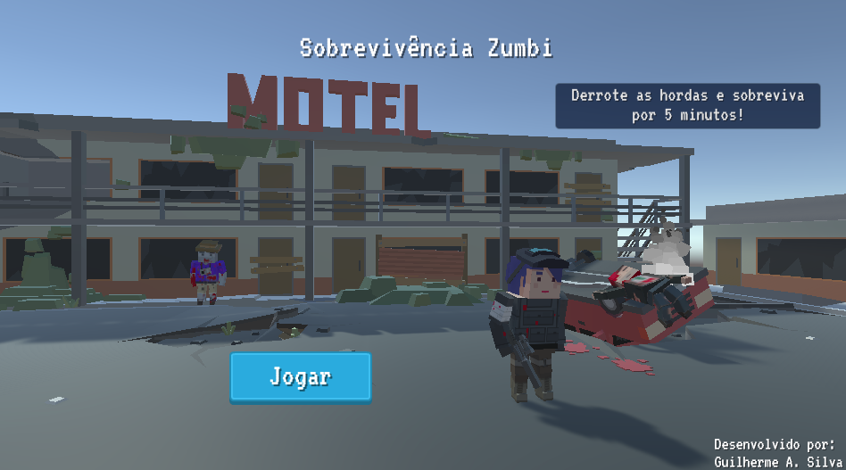
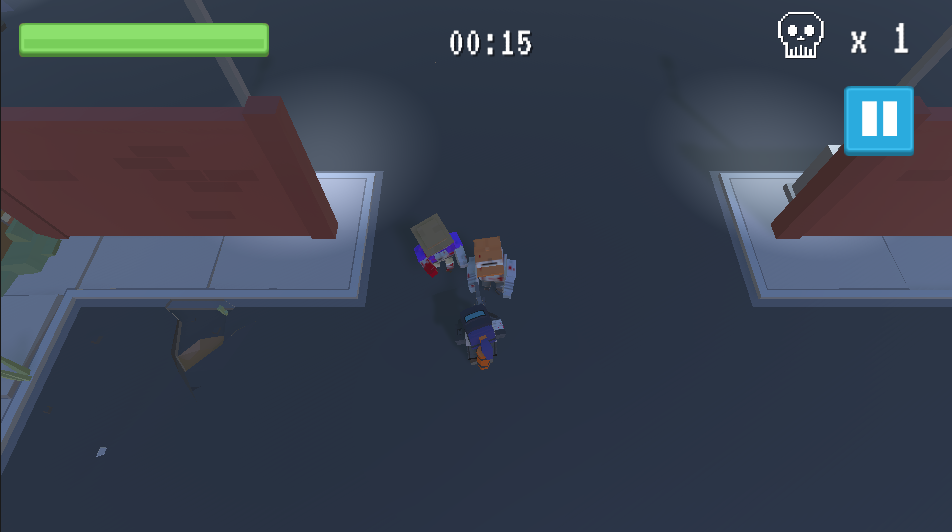

# Sobrevivência Zumbi - Introdução
Jogo digital em Unity3D desenvolvido por meio da formação "Jogos com Unity", oferecido pelo ambiente de cursos online Alura.

Trata-se de um jogo de ação e sobrevivência cujo o objetivo do jogador é sobreviver por 5 minutos, dizimando os zumbis e super-zumbis no cenário. O jogador pode atirar nos zumbis e coletar kit médicos. 

## Imagens

    <strong>Menu 
     

    Em jogo 
     

